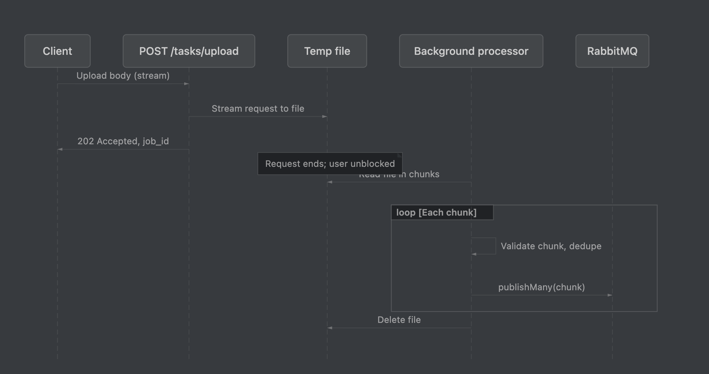

# Task Queue Management System

A NestJS application that processes tasks via a queue: clients submit tasks (JSON payloads), a mock API returns 200/400/500, and the system handles retries (500, up to 2 retries), persistence in PostgreSQL, and optional scaling with multiple workers.

---

## Table of contents

- [Two task submission APIs](#two-task-submission-apis)
- [Architecture](#architecture)
- [Short expectations (how requirements were met)](#short-expectations-how-requirements-were-met)
- [Bonus discussion](#bonus-discussion)
- [Prerequisites & setup](#prerequisites--setup)
- [Configuration](#configuration)
- [Run locally](#run-locally)
- [Swagger](#swagger)
- [Rate limiting](#rate-limiting)
- [API reference](#api-reference)
- [Deployment guidelines](#deployment-guidelines)
- [Scripts](#scripts)

---

## Two task submission APIs

There are **two ways** to submit tasks, depending on data size:

| API | Use case | Body | Response |
|-----|----------|------|----------|
| **POST /tasks** | **Small batches** (e.g. up to 10,000 tasks) | JSON array in request body | **200** – tasks accepted and published to the queue |
| **POST /tasks/upload** | **Large batches** (e.g. 200k–2M tasks) | JSON array or NDJSON, streamed to a temp file | **202 Accepted** – job ID returned; processing runs in the background |

- **POST /tasks**: Request body is parsed as JSON. Tasks are deduplicated by `id` within the request and published to RabbitMQ. Suitable when the payload fits in memory (max 10,000 tasks per request).
- **POST /tasks/upload**: Request body is streamed to a temp file. The server returns immediately with a `jobId`; a background process reads the file in chunks, validates, deduplicates, and publishes to the queue. Use for very large uploads (NDJSON or a single JSON array; JSON array is limited to 150MB in memory).

Both endpoints support an optional query parameter `?concurrency=N` (1 to machine cores × 2) to set the consumer’s runtime concurrency (prefetch).

### Large data injection pipeline (POST /tasks/upload)

For large batches (200k–2M tasks), the **POST /tasks/upload** flow streams the request body to a temp file, returns **202 Accepted** with a `jobId`, and processes the file in the background:

1. **Stream** – Middleware streams the raw body to a temp file (e.g. under `UPLOAD_TEMP_DIR`).
2. **Background processor** – Reads the file (JSON array or NDJSON), validates in chunks, deduplicates by `id`, and publishes to RabbitMQ.
3. **Queue & consumer** – Same main/retry queues and consumer as small batches; final results are stored in PostgreSQL.

Diagram of the large-data pipeline:



---

## Architecture

The system has four main parts: **API**, **queue (producer)**, **processor (consumer)**, and **shared storage**.

```
                    ┌─────────────────────────────────────────────────────────┐
                    │                     NestJS application                     │
                    │  ┌─────────────┐    ┌──────────────────┐    ┌───────────┐ │
  POST /tasks       │  │   Tasks     │───▶│  Task Queue      │    │   Task    │ │
  POST /tasks/upload │  │   Module    │    │  (Producer)       │───▶│ Processor │ │
                    │  │  (API +     │    │  publish to       │    │ (Consumer)│ │
                    │  │   dedup)    │    │  RabbitMQ         │    │ mock API  │ │
                    │  └─────────────┘    └──────────────────┘    │ retry/DB  │ │
                    │         │                     │              └─────┬─────┘ │
                    └─────────┼─────────────────────┼─────────────────────┼───────┘
                              │                     │                   │
                              ▼                     ▼                   ▼
                    ┌─────────────────┐   ┌─────────────┐    ┌─────────────────┐
                    │   PostgreSQL    │   │  RabbitMQ    │    │   PostgreSQL    │
                    │   (task results) │   │  main queue  │    │   tasks table   │
                    │                 │   │  retry queue │    │   (status,       │
                    │                 │   │  DLQ         │    │    retries)      │
                    └─────────────────┘   └─────────────┘    └─────────────────┘
```

- **Tasks module:** Exposes **POST /tasks** (small batches) and **POST /tasks/upload** (large batches). Deduplicates by `id` and publishes to RabbitMQ.
- **Task queue (producer):** Declares exchanges and queues (main, retry, DLQ) and publishes each task to the main queue.
- **Task processor (consumer):** Consumes from main and retry queues. For each message: checks DB to avoid duplicate processing, calls the mock API, then acks, republishes to retry (500, &lt; 2 retries), or persists final result (200/400). Concurrency is configurable via `TASK_CONCURRENCY` or `?concurrency=N` on either POST endpoint; prefetch is synced periodically.
- **PostgreSQL:** Stores task results (id, payload, statusCode, totalRetries) for idempotency and auditing.
- **RabbitMQ:** Main queue for new tasks, retry queue for 500s, DLQ for dead letters. Multiple app instances share the same queues; the broker distributes messages.

**Flow:** Client → **POST /tasks** or **POST /tasks/upload** → Tasks module → Task queue service → RabbitMQ (main queue) → Task consumer → mock API → DB upsert → ack / retry / DLQ as per rules.

---

## Short expectations (how requirements were met)

| Requirement | How it was implemented |
|-------------|------------------------|
| **Queue processor with configurable concurrency** | RabbitMQ consumer with `channel.prefetch(N)`. `N` comes from env `TASK_CONCURRENCY` or from `?concurrency=N` on POST /tasks or POST /tasks/upload (max = machine CPU cores × 2). Prefetch is synced from config every few seconds. |
| **Process the next task immediately when a slot becomes free** | Prefetch limits in-flight messages; as soon as one task is acked, the broker delivers the next. No batching or “wait for all” – one task finishing frees one slot for the next. |
| **Move failed tasks into a retry queue** | On mock API 500, the message is republished to a dedicated retry queue (with `x-retry-count` header). Consumer subscribes to both main and retry queues. |
| **Retry failed tasks up to 2 times** | Retry count is read from message header; after 2 retries (i.e. 3 total attempts), the task is no longer sent to the retry queue. |
| **Stop retrying after the retry limit** | When `retryCount >= 2`, the task is persisted with final status (400) and acked; it is not republished to retry or DLQ. |
| **Produce a final summary of task results** | Every task outcome (200, 400, or 500-after-max-retries) is upserted into PostgreSQL (`Task` entity: id, payload, statusCode, totalRetries). Query the DB or use GET /tasks/jobs/:id for upload-job-level status. |
| **Keep the code clean and modular** | Separate modules: **TasksModule** (API, validation, upload streaming), **TaskQueueModule** (producer), **TaskProcessorModule** (consumer, mock API, retry logic), **ConcurrencyModule** (runtime concurrency), **DatabaseModule** (TypeORM). DTOs and entities are used for validation and persistence. |

---

## Bonus discussion

### 1. How to prevent duplicate processing

- **Within a single request:** For **POST /tasks**, the service deduplicates by task `id` before publishing (only one message per `id` per request). For **POST /tasks/upload**, the background processor deduplicates by `id` within the uploaded file before publishing.
- **Across requests / re-uploads:** Before processing a message, the consumer checks PostgreSQL for an existing row with that task `id`. If **any** record exists (whether statusCode 200, 400, or 500), the message is **skipped** (acked without calling the mock API) and a log line indicates “duplicate, already processed.” So re-uploading the same tasks does not cause duplicate work; the DB is the source of truth for “already handled.”

### 2. How to scale for distributed workers

- **Same code, same queues:** Run multiple instances of the application (e.g. several containers or processes). Each instance connects to the **same** RabbitMQ (same vhost) and the **same** PostgreSQL. No code change is required.
- **RabbitMQ distribution:** Each message is delivered to exactly one consumer. Adding more workers increases throughput (more tasks processed in parallel across the cluster).
- **Concurrency per worker:** Each worker has its own prefetch (concurrency) set by `TASK_CONCURRENCY` or `?concurrency=N`. Total parallelism ≈ number of workers × prefetch until DB or broker becomes the bottleneck.
- **Identity in logs:** Set `WORKER_ID` (e.g. via pod name or hostname) so logs can be attributed to a specific instance.
- **Deployment:** Use Docker Compose `--scale app=N` or Kubernetes `replicas: N`; ensure migrations are run once against the shared DB.

### 3. How to add exponential backoff

- **RabbitMQ connection recovery:** On connection or channel close/error, the consumer (and producer) enter a reconnection loop with **exponential backoff**: initial delay 1s, then 2s, 4s, … up to a cap (e.g. 30s). Formula: `delayMs = Math.min(RECONNECT_MAX_MS, delayMs * 2)`. After a successful reconnect, processing resumes.
- **Retries for 500s:** Failed tasks are republished to the retry queue with an `x-retry-count` header. The broker redelivers them after a short delay (or you can add a TTL/Dead Letter setup for longer backoff between retries if needed). The current implementation retries up to 2 times with immediate redelivery from the retry queue; the same exponential-backoff pattern can be applied to the retry queue (e.g. TTL + DLQ) for spacing out retries over time.

---

## Prerequisites & setup

- **Node.js** 20+
- **Yarn** (or npm)
- **RabbitMQ** (e.g. via Docker)
- **PostgreSQL** 14+ (e.g. via Docker)

```bash
yarn install
cp .env.example .env
# Edit .env with your RabbitMQ and PostgreSQL settings.
```

---

## Configuration

| Variable | Description |
|----------|-------------|
| `PORT` | HTTP server port (default 3000). |
| `THROTTLE_TTL_MS`, `THROTTLE_LIMIT` | Rate limit: `THROTTLE_LIMIT` requests per `THROTTLE_TTL_MS` ms per IP (default 100 per 60000 ms). Returns 429 when exceeded. |
| `TASK_CONCURRENCY` | Default max tasks processed in parallel per worker. Can be overridden at runtime via `?concurrency=N` on POST /tasks or POST /tasks/upload. Max = **machine CPU cores × 2**; higher values return 400. |
| `WORKER_ID` | Optional; identifies this instance in logs when running multiple workers. |
| `RABBITMQ_HOST`, `RABBITMQ_PORT`, `RABBITMQ_VHOST`, `RABBITMQ_DEFAULT_USER`, `RABBITMQ_DEFAULT_PASS` | RabbitMQ connection. |
| `POSTGRES_*` | PostgreSQL connection. |
| `UPLOAD_CHUNK_SIZE`, `UPLOAD_MAX_BYTES`, `UPLOAD_TEMP_DIR` | Large-upload behaviour (chunk size, max body size, temp directory for streamed body). |

---

## Run locally

**1. Start RabbitMQ and PostgreSQL (e.g. Docker Compose):**

```bash
docker compose up -d
```

**2. Run migrations and start the app:**

```bash
make dev
```

Or step by step:

```bash
yarn migration:run
yarn start:dev
```

For production build:

```bash
yarn build && yarn start:prod
```

The app connects to RabbitMQ and PostgreSQL, creates queues/exchanges if needed, and starts consuming. Submit tasks via **POST /tasks** (small) or **POST /tasks/upload** (large); see [API reference](#api-reference).

### Swagger

Interactive API documentation (OpenAPI/Swagger) is available at **GET /api** (Swagger UI). After starting the server, open `http://localhost:3000/api` (or your `PORT`). The server also logs the URL on startup (e.g. `Swagger UI: http://0.0.0.0:3000/api`). You can try all endpoints from the UI, including request body examples; response schemas and possible status codes (200, 202, 400, 429, 503, etc.) are documented there.

### Rate limiting

All API routes are rate-limited per IP using **Throttler**. When the limit is exceeded, the server responds with **429 Too Many Requests**. Limits are configured via `THROTTLE_TTL_MS` and `THROTTLE_LIMIT` (see [Configuration](#configuration)); default is 100 requests per 60 seconds per IP.

---

## API reference

### POST /tasks (small batches)

- **Body:** JSON array of task objects, e.g. `[{ "id": "task-1", "payload": { "type": "email", "to": "user@example.com" } }]`.
- **Query:** Optional `?concurrency=N` (1 to machine cores × 2) to set consumer prefetch.
- **Response:** **200** on success. Max **10,000** tasks per request; for larger batches use **POST /tasks/upload**. Tasks are deduplicated by `id` within the request and published to the queue. **429** when rate limit is exceeded.

### POST /tasks/upload (large batches)

- **Body:** Either a **single JSON array** (including pretty-printed) or **NDJSON** (one JSON object per line). Streamed to a temp file; processed in the background.
- **Query:** Optional `?concurrency=N` (1 to machine cores × 2).
- **Response:** **202 Accepted** with `{ "jobId": "<uuid>", "message": "Upload accepted. Processing in background." }`. Temp files are deleted after processing. Leftover files in the upload temp dir (see `UPLOAD_TEMP_DIR`) can be safely deleted if the server was stopped during processing. **429** when rate limit is exceeded.

### GET /tasks/jobs/:id

Returns status of an upload job: `{ "jobId": "<id>", "status": "processing" | "completed" | "failed", "totalTasks": <n>, "error": "<message>" }`.

### GET /health

Returns **200** and `{ "status": "ok" }` if the app can reach PostgreSQL; otherwise **503**.

---

## Deployment guidelines

- All instances must use the **same RabbitMQ** (same host, vhost) and the **same PostgreSQL** database.
- Run migrations once (e.g. `yarn migration:run`) before or when deploying the first instance.
- Set env vars per environment. For Docker, use service names for hosts (e.g. `RABBITMQ_HOST=rabbitmq`, `POSTGRES_HOST=postgres`).
- **Throughput:** Total concurrent tasks ≈ `number_of_workers × TASK_CONCURRENCY` until RabbitMQ or PostgreSQL becomes the bottleneck.

**Docker:** Build and run with env pointing to RabbitMQ and PostgreSQL. Run migrations from host or a one-off container.

**Docker Compose:** Use `docker compose up -d` and scale workers with `docker compose up -d --scale app=3`.

**Kubernetes:** Deploy the same image with the same env; use `replicas: 3` (or more) for multiple workers. Optionally set `WORKER_ID` via pod name or downward API. Use `GET /health` for liveness/readiness.

---

## Scripts

| Command | Description |
|---------|-------------|
| `yarn build` | Compile the application. |
| `yarn start` | Start once. |
| `yarn start:dev` | Start in watch mode. |
| `yarn start:prod` | Run compiled app. |
| `yarn migration:run` | Run TypeORM migrations. |
| `yarn migration:revert` | Revert last migration. |
| `yarn test` | Unit tests. |
| `yarn test:e2e` | E2E tests. |
| `make dev` | Run migrations then `yarn start:dev`. |

---

## License

UNLICENSED (see `package.json`).
